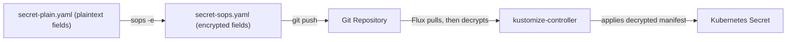

# SOPS + age Secrets PoC

This proof-of-concept demonstrates how to manage Kubernetes Secrets in Git using **SOPS** (Secrets OPerationS) with **age** encryption, decrypted automatically by Flux at apply time.

## What is SOPS?

SOPS is a tool that encrypts specific values in YAML/JSON files while leaving keys and structure visible. This allows you to:

- Store encrypted secrets directly in Git (no external secret store required)
- Review diffs and structure in PRs without exposing values
- Decrypt automatically during GitOps reconciliation

## The Plain Secret (Reference)

The baseline secret is defined in [secret-plain.yaml](../clusters/dev-cluster/apps/sample-app/secret-plain.yaml):

```yaml
apiVersion: v1
kind: Secret
metadata:
  name: sample-app-secret
  namespace: sample-app
type: Opaque
data:
  # echo -n 'Customer A' | base64
  customer-name: Q3VzdG9tZXIgQQ==
  # echo -n 'super-secret-token' | base64
  api-token: c3VwZXItc2VjcmV0LXRva2Vu
```

This file contains:

| Key             | Base64 Value               | Decoded Value        |
| --------------- | -------------------------- | -------------------- |
| `customer-name` | `Q3VzdG9tZXIgQQ==`         | `Customer A`         |
| `api-token`     | `c3VwZXItc2VjcmV0LXRva2Vu` | `super-secret-token` |

**Do NOT commit plain secrets to Git.** This file exists only for reference/demonstration.

## How Secrets Are Consumed

The [deployment.yaml](../clusters/dev-cluster/apps/sample-app/deployment.yaml) consumes the secret in two ways:

**1. Environment variable** — `customer-name` is injected as `CUSTOMER_NAME`:

```yaml
env:
  - name: CUSTOMER_NAME
    valueFrom:
      secretKeyRef:
        name: sample-app-secret
        key: customer-name
```

**2. Volume mount** — `api-token` is mounted as a file:

```yaml
volumes:
  - name: secret-file
    secret:
      secretName: sample-app-secret
      items:
        - key: api-token
          path: api-token.txt
volumeMounts:
  - name: secret-file
    mountPath: /etc/sample-secret
    readOnly: true
```

The app can read the token from `/etc/sample-secret/api-token.txt`.

## Setup Instructions

### Workflow Overview



### 0. Prerequisites

- Flux is installed and reconciling this repo
- `sops` CLI installed (`brew install sops` / `choco install sops`)
- `age` CLI installed (`brew install age` / `choco install age`)

### 1. Generate age key pair

```sh
age-keygen -o age.key
```

This outputs a public key (e.g., `age1abc...`) and creates `age.key` (private key).

### 2. Create decryption secret in cluster

```sh
kubectl -n flux-system create secret generic sops-age-key \
  --from-file=age.agekey=age.key
```

### 3. Encrypt the secret

```sh
sops -e --age <YOUR_AGE_PUBLIC_KEY> \
  clusters/dev-cluster/apps/sample-app/secret-plain.yaml \
  > clusters/dev-cluster/apps/sample-app/secret-sops.yaml
```

The encrypted file preserves YAML structure but encrypts values:

```yaml
apiVersion: v1
kind: Secret
metadata:
  name: sample-app-secret
  namespace: sample-app
type: Opaque
data:
  customer-name: ENC[AES256_GCM,data:...,type:str]
  api-token: ENC[AES256_GCM,data:...,type:str]
sops:
  age:
    - recipient: age1...
      enc: |
        -----BEGIN AGE ENCRYPTED FILE-----
        ...
```

### 4. Configure Flux for SOPS decryption

Add the `decryption` block to your Flux Kustomization:

```yaml
# clusters/dev-cluster/flux-system/apps.yaml
spec:
  decryption:
    provider: sops
    secretRef:
      name: sops-age-key
```

### 5. Update kustomization to use encrypted secret

```yaml
# clusters/dev-cluster/apps/sample-app/kustomization.yaml
resources:
  - deployment.yaml
  - service.yaml
  - secret-sops.yaml  # encrypted secret
```

### 6. Commit and push

```sh
git add clusters/dev-cluster/apps/sample-app/secret-sops.yaml
git commit -m "Add SOPS-encrypted secret"
git push
```

## Verification

Check the secret was created with decrypted values:

```sh
kubectl -n sample-app get secret sample-app-secret -o yaml
```

Verify the app can read them:

```sh
kubectl -n sample-app exec deploy/sample-app -- printenv CUSTOMER_NAME
kubectl -n sample-app exec deploy/sample-app -- cat /etc/sample-secret/api-token.txt
```

## Editing Encrypted Secrets

To modify an encrypted secret:

```sh
SOPS_AGE_KEY_FILE=age.key sops clusters/dev-cluster/apps/sample-app/secret-sops.yaml
```

SOPS decrypts, opens your editor, and re-encrypts on save.

## Troubleshooting

| Issue                    | Check                                                    |
| ------------------------ | -------------------------------------------------------- |
| Flux fails to decrypt    | `kubectl -n flux-system get secret sops-age-key`         |
| Wrong key format         | Key file must contain `AGE-SECRET-KEY-...`               |
| Secret not created       | `kubectl -n flux-system describe kustomization apps`     |
| Decryption block missing | Verify `spec.decryption` in Flux Kustomization           |
| Wrong secret key name    | Flux expects `age.agekey` as the key name in the Secret  |


